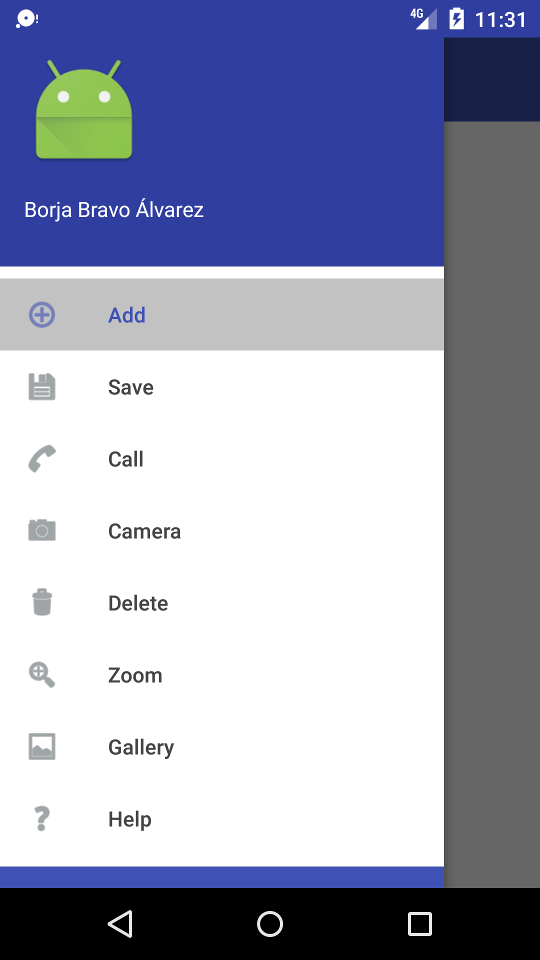

# FooterNavigationView

FooterNavigationView helps to show a footer inside the NavigationView. You'll have scrollable navigation.

## Download
To add the FooterNavigationView library to your Android Studio project, simply add the following gradle dependency:
```java
compile 'com.borjabravo:footernavigationview:1.0.0'
```

## Usage

To use the FooterNavigationView on your app, add the following code to your layout:

```xml
<com.borjabravo.footernavigationview.FooterNavigationView
    android:id="@+id/footer_navigation_view"
    android:layout_width="match_parent"
    android:layout_height="wrap_content"
    app:itemTextColor="@color/text_color_footer_navigation_view"    
    app:itemBackground="@drawable/bg_item_footer_navigation_view"   
    app:itemIconTint="@color/ic_tint_footer_navigation_view"        
    app:menu="@menu/menu_layout"
    app:headerLayout="@layout/header_layout"
    app:footerLayout="@layout/footer_layout"/>
```    
All properties are the same than NavigationView, excepts the footerLayout. This property allows us to show a footer inside the NavigationView. Our custom view has scroll to see all contents.



License
=======

    Copyright 2017 Borja Bravo Álvarez

    Licensed under the Apache License, Version 2.0 (the "License");
    you may not use this file except in compliance with the License.
    You may obtain a copy of the License at

       http://www.apache.org/licenses/LICENSE-2.0

    Unless required by applicable law or agreed to in writing, software
    distributed under the License is distributed on an "AS IS" BASIS,
    WITHOUT WARRANTIES OR CONDITIONS OF ANY KIND, either express or implied.
    See the License for the specific language governing permissions and
    limitations under the License.
